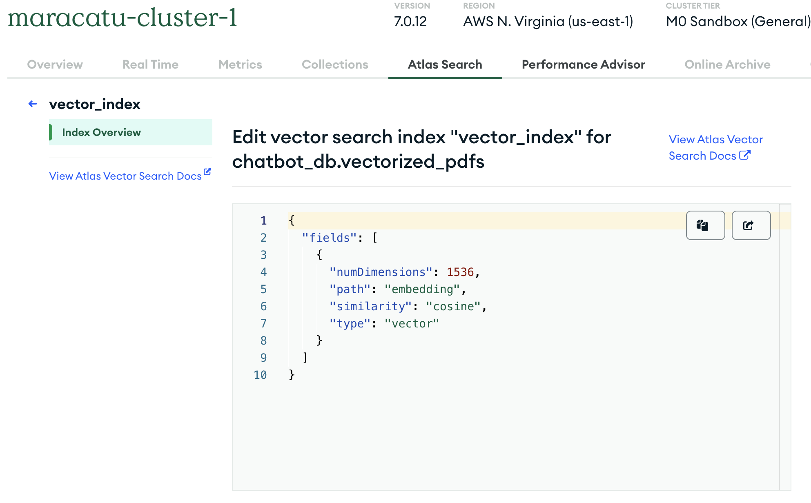

# :computer: Local Machine GenAI Chatbot  application with Streamlit, MongoDB Atlas, Langchain and OpenAI

_'Right Click'_ to watch the __Demo Video__ :arrow_down: in a new browser tab:

<!-- markdownlint-disable-next-line MD033 -->
<a href="https://youtu.be/E0RpmGbmKEg" target="_blank">
<!-- markdownlint-disable-next-line MD033 -->
  
</a>

---
<!-- markdownlint-disable-next-line MD033 -->
<span style="color:darkblue">_version = 1.0.0_</span>
<!-- markdownlint-enable MD033 -->

This Python Retrieval-Augmented Generation (RAG) application is able to read multiple PDFs - up to 200MB at a time - and answer questions based on the information in those PDFs. In simpler terms, it can find relevant information from the PDFs and use that information to answer your questions.

It was developed locally for future Cloud Deployment :cloud: - in AWS and GCP - using Serverless Containers. Application stack:

* **Streamlit** - Front End
* **OpenAi** - LLM/Foundation Model
* **Langchain** - NLP Orchestration
* **MongoDB Atlas Vector Search** - Cloud-based Vector Database
* **Dotenv** - Local secret management
* **PyPDF** - PDF text extraction
* **PyTesseract** - OCR on AES Encrypted PDFs or PDFs with images in the background that would result in an empty text extraction
</br>

## Key Features

* Secure API/TOKEN keys connection hidden in the `.env` file
* Processes multiple files - up to 200MB - within 1 single upload operation
* Capability to answer questions based on documents that are already vectorized and stored in the database - no need to reupload the same PDFs
* Ability to extract text from AES locked PDFs or PDFs with background images that block a simple text extraction
* Text extraction parallel processing for  PDFs > 5MB for faster application performance
* A _'Clear Chat History'_ button
* A series of observability/logs features for future Cloud Development considerations:
  * A Langchain `callback` function that calculates 'OpenAi' token usage and prints it to a logger file.
   
  * MongoDB operation specific logs recorded through the `pymongo` driver
  * A `script execution time` measurement functionality

</br>


---

## Reference Architecture


---

## Prerequisites

* Python >=3.11
* Tesseract CLI
* OpenAI API Key
* MongoDB Atlas Cluster and Database

---

## Setup instructions

Below are the steps on how to setup this application on your local machine :arrow_down:

#### MongoDB Atlas Setup

* Instructions for the free MongoDB Atlas account, cluster and database set up can be found [here](https://www.mongodb.com/docs/atlas/getting-started/).
* Once your cluster and database is set up, navigate to Data Services > Network Access and click on the `IP Access List` tab. Confirm that your local machine IP address is in `Active` Status.
 </br>
  

</br>

* Go to Data Services > Database, click on the `connect` tab, and copy the database connection string into your `.env` file.

</br>


</br>

#### Vector Search Index Creation

The final step after creating a cluster, database, and establishing a connection, is to create a `vector search index`.

* Navigate to Data Services > Your Cluster > Browse Collections > Atlas Search

* Select the database you created for this project - for example, `chatbot_db`  and copy and paste the JSON snippet below.



```json

{
  "fields": [
    {
      "numDimensions": 1536,
      "path": "embedding",
      "similarity": "cosine",
      "type": "vector"
    }
  ]
}

```

* Select _'Next'_
* Confirm _index creation_ by clicking on **Create Search Index**
* The index will be ready for use once is in _'Active Status'_

#### Additional Setup

* Install the [tesseract cli](https://tesseract-ocr.github.io/tessdoc/Command-Line-Usage.html) in your local machine and add the `tesseract location path` to the `.env` file - `pytesseract` is a python package for `tesseract`, however, it works out of the tesseract cli locally installed
* Insert your environment variables in the `.env` file. For reference, see the [sample-dotenv-file.txt](sample-dotenv-file.txt) in this repository.

#### Virtual Environment Activation

* Create a `chatbot-app` virtual environment for your project:
&nbsp;&nbsp;&nbsp;&nbsp;&nbsp;&nbsp;&nbsp;&nbsp;`python -m venv chatbot-env`
* Activate it:
&nbsp;&nbsp;&nbsp;&nbsp;&nbsp;&nbsp;&nbsp;&nbsp;`source chatbot-env/bin/activate`
* Install the dependencies:
&nbsp;&nbsp;&nbsp;&nbsp;&nbsp;&nbsp;&nbsp;&nbsp;`pip install -r requirements.txt`  

#### Shell Script

As an option, edit the `sample_run_chatbot.sh` bash script with your local machine project directory, and run this script to either activate the venv and run streamlit, or in case the venv is activated, to run streamlit:

`./sample_run_chatbot.sh`

---

## Future Improvements

* Create a *'Web URL Input'* functionality, so that the user has the option to either upload a file or add a PDF web url
* Implement PDF metadata extraction. Create a _'document uploaded'_ metadata JSON file that will be sent into a separate  _MongoDB Atlas  Database_ so that there is a record of all the PDFs previously vectorized. That way that the user will be able to view a list of these PDFs and ask questions about them
* Create a drop down box in the UI, so that the user can view these available PDF file names
* Cloud Native Deployment on AWS and GCP
